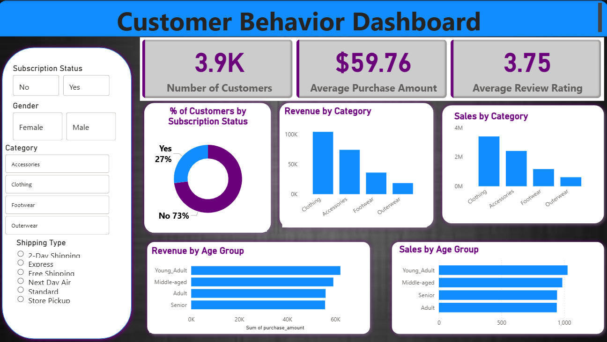

# Customer Trends Data Analysis Using SQL, Python & Power BI

---

## Project Overview

This repository presents a comprehensive, end-to-end analytics solution focused on understanding customer behaviors and uncovering significant sales trends. Key components leverage **SQL** for data extraction, **Python** for advanced analytics and data manipulation, and **Power BI** for interactive business-ready visualization.  
**Project Objectives:**
- Identify recurring sales patterns and key customer segments.
- Deliver actionable business recommendations based on data insights.
- Demonstrate expertise in analytics, data storytelling, and dashboard design.

---

## Core Features

- **Data Acquisition & Cleansing:** Streamlined retrieval and preprocessing of customer and sales datasets to ensure robust analysis.
- **Temporal Trend Insights:** Analysis of dynamic changes in customer activities and purchasing habits over defined periods.
- **Statistical & Predictive Analysis:** Generation of descriptive statistics, forecasting, and modeling for deeper business understanding.
- **Interactive Visualization:** Professional dashboards and reports in Power BI tailored for executive and stakeholder review.
- **Business Impact Recommendations:** Data-driven findings to support marketing, sales, and operational strategy.

---

## Tools Used

- **SQL:** Efficient querying and manipulation of raw data.
- **Python:** Data wrangling, exploratory analysis, statistical modeling (using Jupyter Notebook environment).
- **Power BI:** Creation of interactive reports and business-ready dashboards.
- **Jupyter Notebook:** Hands-on data exploration and visualization.

---

## Project Deliverables

- **Power BI Dashboard:**  
  
  
- **Python Analysis (Jupyter Notebook):**  [Python Analysis](customer_behaviour.ipynb)  
- **SQL Queries:**  [SQL Query](customer_behaviour_sql_queries.sql)  
- **Source Data:**  [customer_shopping_behavior.csv](customer_shopping_behavior.csv)

---

## Summary of Findings

- Pinpointed core customer segments responsible for growth and revenue uplift.
- Discovered seasonal and periodic increases in sales, useful for inventory and campaign planning.
- Proposed marketing and sales recommendations driven by actionable insights.
- Demonstrated a streamlined process integrating SQL, Python analytics, and Power BI visualization.

---

## Author & Contact Information

| Name          | Profile                               |
| ------------- | ------------------------------------- |
| **Neha Yadav**| [GitHub](https://github.com/Neha-Ydv) |
|               | [LinkedIn](https://linkedin.com/in/your-link-here) |

---

---
